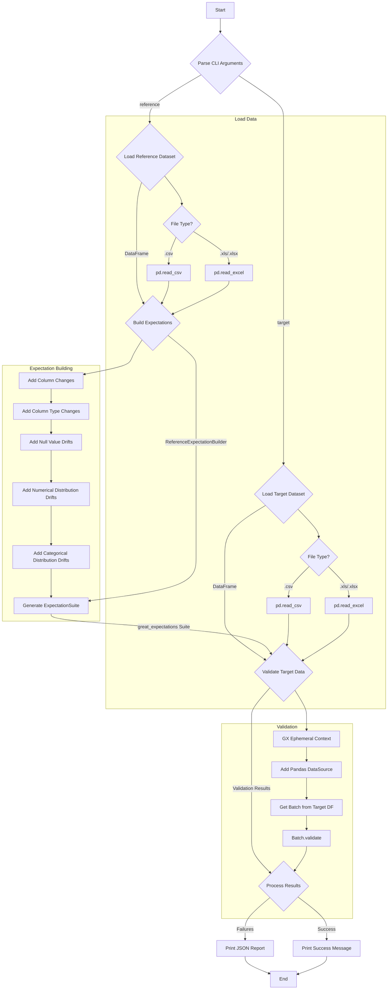

# drift_detector

A modular Python command-line interface (CLI) tool designed to detect data drift between a reference dataset and a target dataset. It leverages the Great Expectations library to define and validate data expectations, providing a structured JSON report of any detected anomalies.

## Features

The `drift_detector` performs a variety of checks to identify different types of data drift:

*   **Schema Drift:** Detects additions or removals of columns.
*   **Column Type Drift:** Validates that column data types remain consistent.
*   **Null Value Drift:** Checks for significant changes in the proportion of non-null values within columns.
*   **Numerical Distribution Drift:** Monitors shifts in the mean and standard deviation for numerical columns.
*   **Categorical Distribution Drift:** Identifies changes in the frequency distribution of categorical values using KL Divergence.
*   **String Pattern Drift:** Verifies if column values adhere to expected string patterns (e.g., regex).

The tool uses an in-memory Great Expectations context for clean execution, avoiding the creation of persistent files.

## Dependencies

*   pandas
*   openpyxl
*   great-expectations

## Installation

To install the project, navigate to the root directory and run:

```bash
pip install .
```
or for development:
```bash
pip install -r requirements.txt
pip install -e .
```

## Usage

Once installed, you can run the command-line tool by providing paths to your reference and target data files. The tool supports both CSV and Excel (`.xlsx`, `.xls`) formats.

```bash
drift_detector --reference path/to/your/reference.csv --target path/to/your/target.xlsx
```

The output will be a JSON report detailing any failed expectations, including the type of check, severity, a short description of the failure, the expected parameters, and the observed data.

Example JSON output for a failed check:

```json
[
  {
    "type_of_check": "expect_table_columns_to_match_set",
    "severity": "N/A",
    "description": "Failed: expect_table_columns_to_match_set",
    "expected_data": {
      "column_set": [
        "id",
        "product_code",
        "category",
        "quantity",
        "price",
        "rating",
        "last_updated"
      ]
    },
    "observed_data": {
      "observed_value": [
        "id",
        "product_code",
        "category",
        "quantity",
        "price",
        "last_updated",
        "comment"
      ]
    }
  }
]
```

## Flow Diagram

The following diagram illustrates the high-level workflow of the `drift_detector` tool:



**Explanation:**

1.  **Parse CLI Arguments:** The tool starts by parsing the command-line arguments to get the paths for the reference and target datasets.
2.  **Load Datasets:** It loads both the reference and target files into pandas DataFrames, supporting CSV and Excel formats.
3.  **Build Expectations:** The `ReferenceExpectationBuilder` analyzes the reference DataFrame to create a Great Expectations `ExpectationSuite`. This includes checks for schema, types, nulls, and distributions.
4.  **Validate Target Data:** The `run_validation` function in `validator.py` uses an ephemeral Great Expectations context to validate the target DataFrame against the generated `ExpectationSuite`.
5.  **Process Results:** The validation results are processed. If there are failures, a JSON report is generated and printed. Otherwise, a success message is displayed.

## Development

For development, install in editable mode:

```bash
pip install -e .
```

## Running Tests

To run the comprehensive test suite (including unit and integration tests) and generate a coverage report:

```bash
python3 -m pytest --cov=drift_detector/core drift_detector/tests/
```